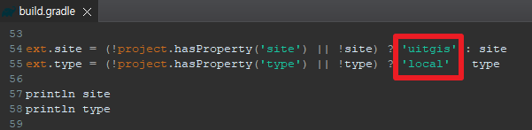
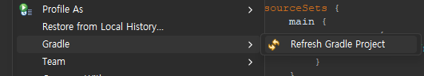
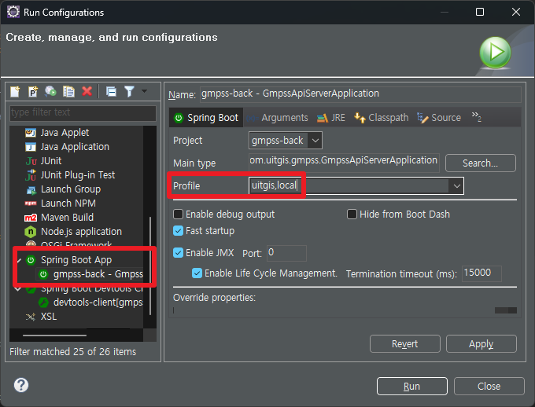
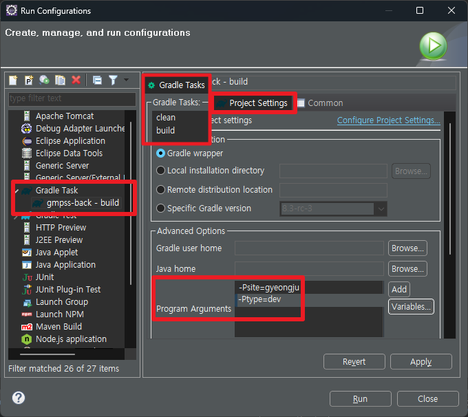
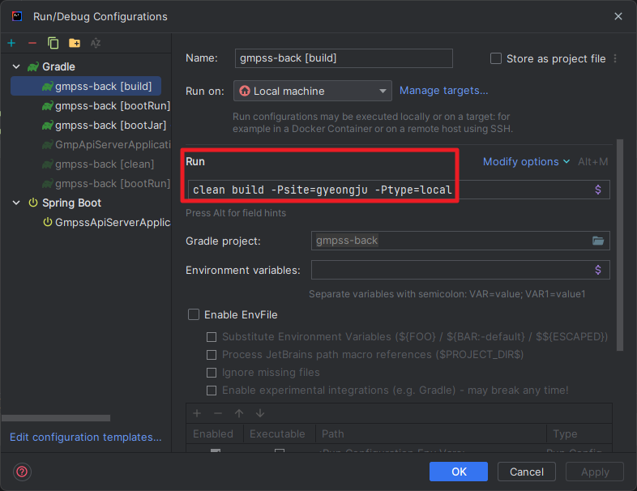

<div align="center">
  <h1>성장관리계획관리시스템</h1>
</div>


#### 구글 스프레시트 링크
https://docs.google.com/spreadsheets/d/1ML_0PK1E2lbiHkBryyYbbclmN5Vxkj0kys3LdBtGG4Y/edit?usp=sharing

#### 레이어 api 
http://localhost:8081/ciams/api/v1/plan/layer/get

레이어 명명 규칙  GMP_[데이터셋코드]_[그룹코드]_[그룹상세코드]_[넘버링]    예시) GMP_P1_B3_DSTPLAN_06

---


## Run) Eclipse - Spring Boot
```
1. build.gradle 수정 (Git 커밋 X)
 - site, type 변수 디폴트 값 적용
  ex:개발/local): site = uitgis / type = local
  ex:경주/local): site = gyeongju / type = local
```


<br/>

```
2. Refresh Gradle Project
```


<br/>

```
3. Run Configurations
```


---


## Run) IntelliJ - Spring Boot
```
build.gradle 수정 (Git 커밋 X)
 - site, type 변수 디폴트 값 적용
  ex:개발/local): site = uitgis / type = local
  ex:경주/local): site = gyeongju / type = local
```


---


## Build) Eclipse
```
1. Gradle Tasks : clean, build
2. Program Arguments 설정
 ex:개발/local): -Psite=uitgis -Ptype=local
 ex:경주/dev): -Psite=gyeongju -Ptype=dev
```


---


## Build) IntelliJ
```
Run/Debug Configurations 설정
 ex:개발/local): clean build -Psite=uitgis -Ptype=local
 ex:경주/dev): clean build -Psite=gyeongju -Ptype=dev
```


---


## Build) CLI
```
site, type Parameters 설정
 ex:개발/local): -Psite=uitgis -Ptype=local
 ex:경주/dev): -Psite=gyeongju -Ptype=dev
 
 프로젝트root경로> .\gradlew.bat clean build -Psite=gyeongju -Ptype=dev
```

---

